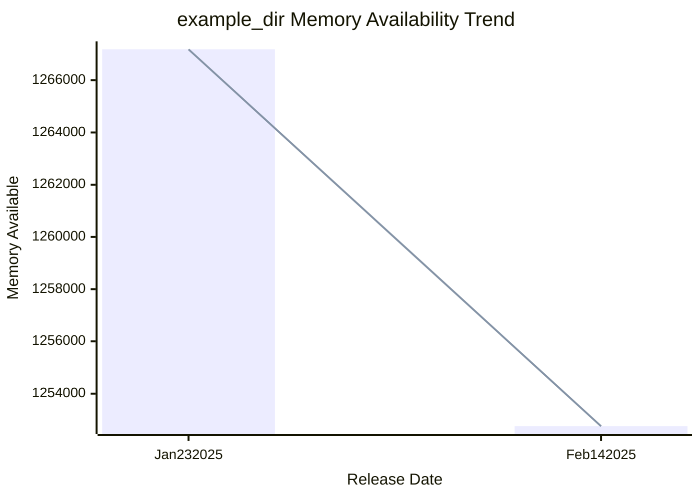

# L4-vendor-memory-test-results

## example_dir

```mermaid
xychart-beta
    title "example_dir Memory Availability Trend"
    x-axis "Release Date" [Jan 23 2025, Feb 14 2025]
    y-axis "Memory Available" 1252752 --> 1267184
    bar [1267184, 1252752]
    line [1267184, 1252752]
```

